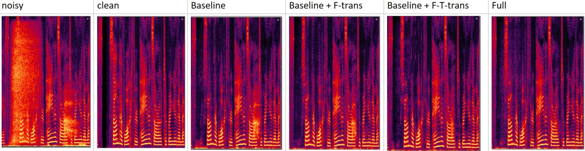
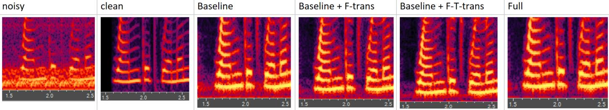
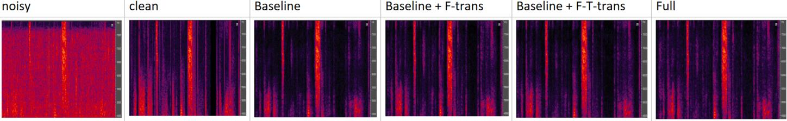
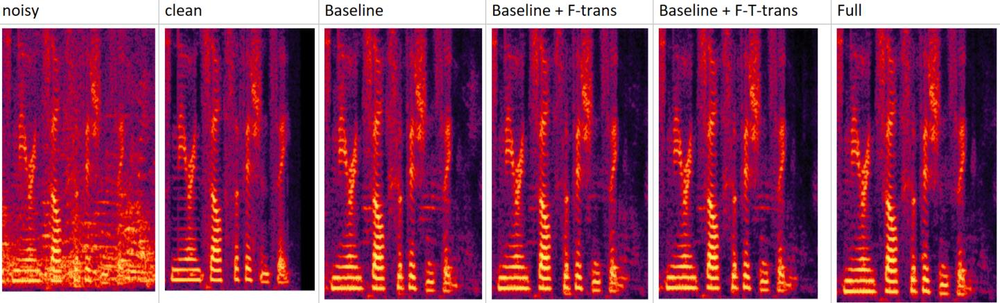
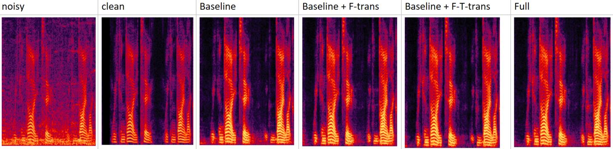

## PT-FSE audio demos
We randomly choose six test audio samples and list them here as enhancement demos.
The figures of each demo group contain highlighted parts of the T-F spectrograms.

If you have any questions or concerns, please send email to wanxucheng@huawei.com

### Example One

Noisy:<audio id="audio" controls="" preload="none"> <source id="mp3" src="./audios/noisy_clnsp22_breath_21983_0_snr1_tl-18_fileid_50.wav">

Clean:<audio id="audio" controls="" preload="none"> <source id="mp3" src="./audios/clean_fileid_50.wav">

Baseline:<audio id="audio" controls="" preload="none"><source id="mp3" src="./audios/baseline_clnsp22_breath_21983_0_snr1_tl-18_fileid_50.wav"></audio>

Baseline + F-trans: <audio id="audio" controls="" preload="none"> <source id="mp3" src="./audios/Ftrans_clnsp22_breath_21983_0_snr1_tl-18_fileid_50.wav">

Baseline + F-trans + T-trans
<audio id="audio" controls="" preload="none"><source id="mp3" src="./audios/FTtrans_clnsp22_breath_21983_0_snr1_tl-18_fileid_50.wav">

FULL:<audio id="audio" controls="" preload="none"> <source id="mp3" src="./audios/FULL_clnsp22_breath_21983_0_snr1_tl-18_fileid_50.wav">

### Example Two

Noisy:
<audio id="audio" controls="" preload="none">
    <source id="mp3" src="./audios/noisy_clnsp198_bus_56903_0_snr0_tl-32_fileid_101.wav">
</audio>

Clean:
<audio id="audio" controls="" preload="none">
    <source id="mp3" src="./audios/clean_fileid_50.wav">
</audio>

Baseline:
<audio id="audio" controls="" preload="none">
    <source id="mp3" src="./audios/baseline_clnsp198_bus_56903_0_snr0_tl-32_fileid_101.wav">
</audio>

Baseline + F-trans:
<audio id="audio" controls="" preload="none">
    <source id="mp3" src="./audios/Ftrans_clnsp198_bus_56903_0_snr0_tl-32_fileid_101.wav">
</audio>

Baseline + F-trans + T-trans
<audio id="audio" controls="" preload="none">
    <source id="mp3" src="./audios/FTtrans_clnsp198_bus_56903_0_snr0_tl-32_fileid_101.wav">
</audio>

FULL:
<audio id="audio" controls="" preload="none">
    <source id="mp3" src="./audios/FULL_clnsp198_bus_56903_0_snr0_tl-32_fileid_101.wav">
</audio>

### Example Three

Noisy:
<audio id="audio" controls="" preload="none">
    <source id="mp3" src="./audios/noisy_clnsp149_SjEWn2DhLDs_snr0_tl-23_fileid_58.wav">
</audio>

Clean:
<audio id="audio" controls="" preload="none">
    <source id="mp3" src="./audios/clean_fileid_58.wav">
</audio>

Baseline:
<audio id="audio" controls="" preload="none">
    <source id="mp3" src="./audios/baseline_clnsp149_SjEWn2DhLDs_snr0_tl-23_fileid_58.wav">
</audio>

Baseline + F-trans:
<audio id="audio" controls="" preload="none">
    <source id="mp3" src="./audios/Ftrans_clnsp149_SjEWn2DhLDs_snr0_tl-23_fileid_58.wav">
</audio>

Baseline + F-trans + T-trans
<audio id="audio" controls="" preload="none">
    <source id="mp3" src="./audios/FTtrans_clnsp149_SjEWn2DhLDs_snr0_tl-23_fileid_58.wav">
</audio>

FULL:
<audio id="audio" controls="" preload="none">
    <source id="mp3" src="./audios/FULL_clnsp149_SjEWn2DhLDs_snr0_tl-23_fileid_58.wav">
</audio>

### Example Four

Noisy:
<audio id="audio" controls="" preload="none">
    <source id="mp3" src="./audios/noisy_clnsp156_water_320289_2_snr3_tl-19_fileid_125.wav">
</audio>

Clean:
<audio id="audio" controls="" preload="none">
    <source id="mp3" src="./audios/clean_fileid_125.wav">
</audio>

Baseline:
<audio id="audio" controls="" preload="none">
    <source id="mp3" src="./audios/baseline_clnsp156_water_320289_2_snr3_tl-19_fileid_125.wav">
</audio>

Baseline + F-trans:
<audio id="audio" controls="" preload="none">
    <source id="mp3" src="./audios/Ftrans_clnsp156_water_320289_2_snr3_tl-19_fileid_125.wav">
</audio>

Baseline + F-trans + T-trans
<audio id="audio" controls="" preload="none">
    <source id="mp3" src="./audios/FTtrans_clnsp156_water_320289_2_snr3_tl-19_fileid_125.wav">
</audio>

FULL:
<audio id="audio" controls="" preload="none">
    <source id="mp3" src="./audios/FULL_clnsp156_water_320289_2_snr3_tl-19_fileid_125.wav">
</audio>

### Example Five

Noisy:
<audio id="audio" controls="" preload="none">
    <source id="mp3" src="./audios/noisy_clnsp430_babble_188218_23_snr8_tl-22_fileid_280.wav">
</audio>

Clean:
<audio id="audio" controls="" preload="none">
    <source id="mp3" src="./audios/clean_fileid_280.wav">
</audio>

Baseline:
<audio id="audio" controls="" preload="none">
    <source id="mp3" src="./audios/baseline_clnsp430_babble_188218_23_snr8_tl-22_fileid_280.wav">
</audio>

Baseline + F-trans:
<audio id="audio" controls="" preload="none">
    <source id="mp3" src="./audios/Ftrans_clnsp430_babble_188218_23_snr8_tl-22_fileid_280.wav">
</audio>

Baseline + F-trans + T-trans
<audio id="audio" controls="" preload="none">
    <source id="mp3" src="./audios/FTtrans_clnsp430_babble_188218_23_snr8_tl-22_fileid_280.wav">
</audio>

FULL:
<audio id="audio" controls="" preload="none">
    <source id="mp3" src="./audios/FULL_clnsp430_babble_188218_23_snr8_tl-22_fileid_280.wav">
</audio>

### Example Six

Noisy:
<audio id="audio" controls="" preload="none">
    <source id="mp3" src="./audios/noisy_clnsp57_bus_84241_3_snr2_tl-30_fileid_300.wav">
</audio>

Clean:
<audio id="audio" controls="" preload="none">
    <source id="mp3" src="./audios/clean_fileid_300.wav">
</audio>

Baseline:
<audio id="audio" controls="" preload="none">
    <source id="mp3" src="./audios/baseline_clnsp57_bus_84241_3_snr2_tl-30_fileid_300.wav">
</audio>

Baseline + F-trans:
<audio id="audio" controls="" preload="none">
    <source id="mp3" src="./audios/Ftrans_clnsp57_bus_84241_3_snr2_tl-30_fileid_300.wav">
</audio>

Baseline + F-trans + T-trans
<audio id="audio" controls="" preload="none">
    <source id="mp3" src="./audios/FTtrans_clnsp57_bus_84241_3_snr2_tl-30_fileid_300.wav">
</audio>

FULL:
<audio id="audio" controls="" preload="none">
    <source id="mp3" src="./audios/FULL_clnsp57_bus_84241_3_snr2_tl-30_fileid_300.wav">
</audio>
